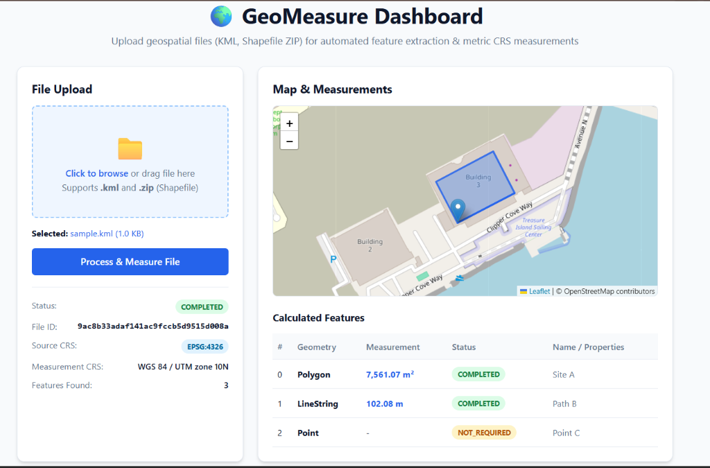

# GeoMeasure API

A clean, well-structured REST API and interactive dashboard that accepts geospatial files (KML and Shapefile), extracts features, handles CRS transformations, and returns accurate metric measurements.


## 📸 Interactive Web Dashboard



> **Live UI:** Access the interactive dashboard at `http://localhost:8000/` to drag-and-drop geospatial files, view interactive Leaflet map previews, and inspect feature-by-feature metric measurements in real time.

---

## Features

- **Interactive Web Dashboard** — Drag-and-drop file upload with live Leaflet map rendering & measurements table
- **Upload KML files** or **ZIP archives containing Shapefiles**
- **Extract geospatial features** — geometry type, geometry, CRS, and properties
- **Automatic CRS handling** — detects geographic (EPSG:4326) coordinates and projects to the appropriate UTM zone for accurate measurements
- **Calculate measurements** — area in m² for Polygons, length in m for LineStrings
- **Graceful handling** — Points return no measurement, unsupported geometry types are flagged
- **Persist results** to SQLite via SQLAlchemy
- **Retrieve by ID** — file metadata and full measurements via GET endpoints
- **Security** — safe ZIP extraction (path traversal prevention), file size limits, extension validation
- **25 automated tests** covering all core functionality

---

## Architecture

```
geo-measure-api/
├── app/
│   ├── main.py             # FastAPI app factory, lifespan (DB init)
│   ├── api/routes/
│   │   └── files.py        # POST /api/files/, GET /{id}/, GET /{id}/measurements/
│   ├── core/
│   │   └── config.py       # Pydantic settings (env-based config)
│   ├── database/
│   │   ├── database.py     # SQLAlchemy engine, session, get_db dependency
│   │   └── models.py       # FileRecord model
│   ├── schemas/
│   │   └── file.py         # Pydantic request/response models
│   ├── services/
│   │   ├── file_processor.py  # GeoDataFrame extraction logic (KML + Shapefile)
│   │   ├── crs.py             # CRS detection and UTM projection
│   │   └── measurement.py     # Area / length calculation rules
│   └── utils/
│       ├── file_utils.py      # Upload validation and streaming save
│       └── zip_utils.py       # Secure ZIP extraction, .shp discovery
└── tests/                  # pytest test suite (25 tests)
```

### Layered Design

| Layer | Responsibility |
|---|---|
| **API** | HTTP routing, request validation, response serialization |
| **Services** | Geospatial processing, CRS transformation, measurements |
| **Database** | Persistence of file metadata and processed results |
| **Schemas** | Pydantic models defining the API contract |
| **Utils** | Pure utility functions (file saving, ZIP security) |

---

## API Endpoints

### `POST /api/files/`
Upload a geospatial file. Returns processing results synchronously.

**Accepts:** `multipart/form-data` with `file` field — `.kml` or `.zip` (containing Shapefile)

**Response:**
```json
{
  "id": "abc123...",
  "filename": "survey.kml",
  "file_type": "kml",
  "size_bytes": 1024,
  "status": "COMPLETED",
  "crs": "EPSG:4326",
  "measurement_crs": "WGS 84 / UTM zone 10N",
  "feature_count": 3,
  "features": [
    {
      "feature_id": "0",
      "geometry_type": "Polygon",
      "geometry": { "type": "Polygon", "coordinates": [...] },
      "crs": "EPSG:4326",
      "properties": { "name": "Site A" },
      "measurement": 7561.07,
      "unit": "m²",
      "measurement_status": "COMPLETED"
    }
  ]
}
```

### `GET /api/files/{id}/`
Retrieve metadata for a previously uploaded file.

### `GET /api/files/{id}/measurements/`
Retrieve the full feature list with measurements for a processed file.

### `GET /health`
Health check.

---

## Geospatial Design Decisions

### Why UTM instead of measuring in EPSG:4326?
WGS84 (EPSG:4326) stores coordinates in degrees (latitude/longitude). Calculating area or length directly on degree-coordinates produces meaningless results because one degree of longitude varies in real-world distance depending on latitude.

**Solution:** GeoPandas' `estimate_utm_crs()` automatically selects the optimal UTM projection zone based on the dataset's centroid. UTM is a conformal projection that preserves distances and areas within a zone, making it ideal for localized geospatial measurements.

### Why pyogrio instead of fiona?
`fiona` has no Python 3.11+ binary wheels available. `pyogrio` is the modern GDAL-backed I/O backend for GeoPandas — it is actually the recommended backend for GeoPandas 1.0+.

### Why synchronous processing?
Processing happens in the same HTTP request to keep the architecture simple and easy to reason about. For production, this would move to a background task queue (e.g., Celery + Redis), which is documented as a future improvement.

### Why JSON column for measurements?
The measurements are stored as a JSON column on the `FileRecord` table instead of a separate `Feature` table. This avoids over-engineering a highly relational schema for a geospatial store where features are always read as a batch. It keeps the database layer simple while meeting all retrieval requirements.

---

## Setup and Running

### Requirements
- Python 3.11+
- pip

### Install

```bash
git clone https://github.com/ChethanaSB/geo-measure-api.git
cd geo-measure-api

python -m venv .venv
source .venv/bin/activate  # Windows: .venv\Scripts\activate

pip install -r requirements.txt
```

### Configure

```bash
cp .env.example .env
# Edit .env if needed (defaults work out of the box)
```

### Run

```bash
uvicorn app.main:app --reload
```

Visit [http://localhost:8000/docs](http://localhost:8000/docs) for the interactive API documentation.

### Run with Docker

```bash
docker build -t geo-measure-api .
docker run -p 8000:8000 geo-measure-api
```

---

## Running Tests

```bash
pytest tests/ -v
```

**Test coverage:**
- Upload validation (missing file, wrong extension, empty file)
- KML processing (structure, Polygon area, LineString length, Point handling)
- Shapefile ZIP processing (valid upload, missing .shp, path traversal rejection)
- CRS service (geographic detection, UTM projection, already-projected, missing CRS)
- API endpoints (GET file info, GET measurements, 404 handling, health check)

---

## Sample Data

The `sample_data/` directory contains:
- `sample.kml` — KML with a Polygon, LineString, and Point (EPSG:4326, San Francisco area)
- `sample.zip` — ZIP containing a Shapefile with a Polygon (EPSG:4326)

---

## Future Improvements

- **Background processing** — Move file processing to Celery + Redis for large files
- **Authentication** — JWT-based auth for multi-tenant use
- **Pagination** — `GET /api/files/` listing endpoint with pagination
- **File cleanup** — Scheduled job to purge old uploaded files
- **More geometry types** — Full support for MultiPolygon, MultiLineString aggregated measurements
- **Cloud storage** — Replace local `uploads/` with S3 or GCS
- **CI/CD** — GitHub Actions workflow for automated test runs on push

---

## Tech Stack

| Technology | Purpose |
|---|---|
| FastAPI | REST API framework |
| GeoPandas | Geospatial data reading and CRS handling |
| Shapely | Geometry operations |
| PyProj | CRS definitions and projections |
| pyogrio | GDAL-backed file I/O (KML, Shapefile) |
| SQLAlchemy | ORM for database persistence |
| SQLite | Embedded database |
| Pydantic | Request/response validation |
| pytest | Test framework |
| Docker | Containerization |
