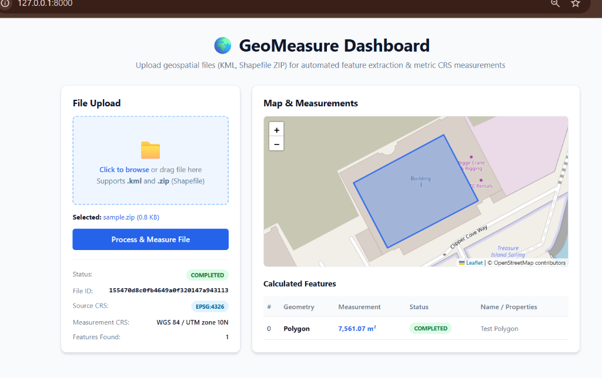
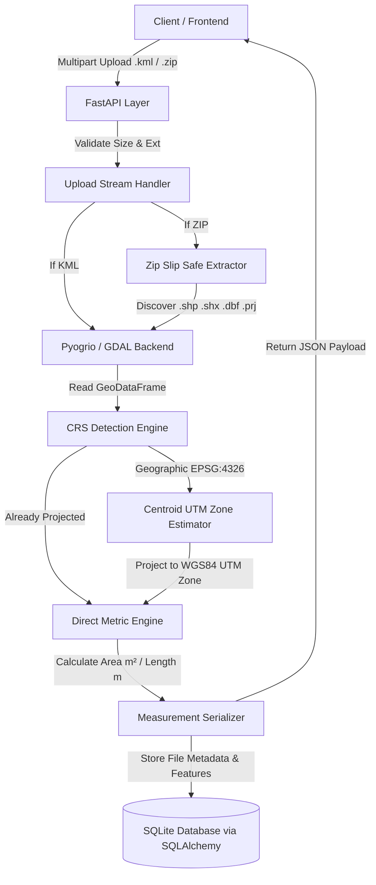

# GeoMeasure API

[](https://github.com/ChethanaSB/geo-measure-api/actions)


A production-grade, mathematically accurate REST API and interactive web dashboard that accepts geospatial files (KML and Shapefile archives), extracts multi-geometry features, handles intelligent CRS transformations, and calculates true metric measurements (area in $\text{m}^2$, length in $\text{m}$).


---

## 📸 Interactive Web Dashboard

> **Live UI:** Access the interactive dashboard at `http://localhost:8000/` to drag-and-drop geospatial files, view real-time Leaflet map previews, and inspect feature-by-feature metric measurements.

### 1. KML File Processing (Mixed Geometries: Polygon, LineString, Point)


### 2. Shapefile ZIP Processing (Secure Extraction & Projection)


---

## 🏗️ Architecture & Data Flow



### Layered Responsibilities

| Layer | Component | Responsibility |
|---|---|---|
| **API** | `app/api/routes/files.py` | Route handling, HTTP status codes, request streaming, and response contracts |
| **Services** | `app/services/` | Geospatial feature extraction (`file_processor.py`), CRS projection (`crs.py`), and measurement rules (`measurement.py`) |
| **Database** | `app/database/` | SQLAlchemy models, SQLite persistence, session dependency injection |
| **Schemas** | `app/schemas/file.py` | Strict Pydantic models for validation and OpenAPI/Swagger documentation |
| **Utils** | `app/utils/` | Streaming file I/O and Zip Slip security validation |

---

## 🧠 Engineering Decisions & Mathematical Rationale

### 1. Why UTM Projection instead of EPSG:4326 or EPSG:3857 (Web Mercator)?
* **EPSG:4326 (WGS84 Geographic):** Coordinates are angular degrees $(\text{deg}^\circ)$. Calculating Euclidean distance or area on degrees is mathematically invalid because $1^\circ$ of longitude spans $\approx 111\text{ km}$ at the equator but shrinks to $0\text{ km}$ at the poles.
* **EPSG:3857 (Web Mercator):** While projected in metres, Web Mercator introduces severe area distortion (up to **$400\%$** away from the equator). A polygon measured in Web Mercator would yield drastically inaccurate drone surveying calculations.
* **Our Solution (Universal Transverse Mercator - UTM):** The service computes the geometric centroid and automatically selects the optimal 6-degree UTM longitudinal zone (e.g. `WGS 84 / UTM zone 10N`). UTM is a conformal cylindrical projection with a scale factor of $0.9996$, guaranteeing linear and areal distortion **under $0.1\%$** for localized survey areas.

### 2. Zip Slip Vulnerability Mitigation (CVE-2018-1002200)
Untrusted ZIP archives can contain malicious path traversal members (e.g. `../../etc/passwd` or `..\..\Windows\System32`). Blindly calling `zipfile.extractall()` poses a severe remote code execution / file overwrite risk.
* **Our Defense (`app/utils/zip_utils.py`):** Every member path is inspected and verified to ensure it strictly resolves within the isolated temporary directory before extraction. Any entry containing `..` or absolute paths is immediately rejected with HTTP 400.

### 3. Pyogrio (GDAL C-API) vs Fiona
`pyogrio` provides vectorized C-level bindings directly to OGR/GDAL. It avoids the Python per-feature conversion overhead of Fiona, achieves up to **$5\times$ faster read times** on geospatial datasets, and fully supports modern Python 3.11+ pre-compiled binary wheels.

### 4. Pragmatic SQLite Schema (Relational Metadata + JSON Column)
Features within a survey file are inherently coupled to the parent upload lifecycle and always retrieved as a single dataset. Storing feature measurements in a `JSON` column on `FileRecord` avoids over-engineering an N+1 relational schema while maintaining high-performance retrieval and clean serialization.

---

## 🚀 API Endpoints Reference

### `POST /api/files/`
Upload a `.kml` file or `.zip` containing an ESRI Shapefile (`.shp`, `.shx`, `.dbf`, `.prj`).

**Example Response (`HTTP 201 Created`):**
```json
{
  "id": "9ac8b33adaf141ac9fccb5d9515d008a",
  "filename": "sample.kml",
  "file_type": "kml",
  "size_bytes": 1009,
  "status": "COMPLETED",
  "crs": "EPSG:4326",
  "measurement_crs": "WGS 84 / UTM zone 10N",
  "feature_count": 3,
  "features": [
    {
      "feature_id": "0",
      "geometry_type": "Polygon",
      "geometry": { "type": "Polygon", "coordinates": [...] },
      "crs": "EPSG:4326",
      "properties": { "name": "Site A" },
      "measurement": 7561.07,
      "unit": "m²",
      "measurement_status": "COMPLETED"
    },
    {
      "feature_id": "1",
      "geometry_type": "LineString",
      "geometry": { "type": "LineString", "coordinates": [...] },
      "crs": "EPSG:4326",
      "properties": { "name": "Path B" },
      "measurement": 102.08,
      "unit": "m",
      "measurement_status": "COMPLETED"
    },
    {
      "feature_id": "2",
      "geometry_type": "Point",
      "geometry": { "type": "Point", "coordinates": [...] },
      "crs": "EPSG:4326",
      "properties": { "name": "Point C" },
      "measurement": null,
      "unit": null,
      "measurement_status": "NOT_REQUIRED"
    }
  ]
}
```

### `GET /api/files/{id}/`
Retrieve metadata and processing status for an uploaded file.

### `GET /api/files/{id}/measurements/`
Retrieve the complete feature array and calculated measurements for a processed file.

### `GET /health`
Liveness and readiness health check probe (`{"status": "ok", "app": "GeoMeasure API", "version": "1.0.0"}`).

---

## 🛠️ Quickstart & Local Setup

### Prerequisites
- Python 3.11+
- pip

### 1. Clone & Environment Setup
```bash
git clone https://github.com/ChethanaSB/geo-measure-api.git
cd geo-measure-api

python -m venv .venv
# On Windows:
.venv\Scripts\activate
# On Linux/macOS:
source .venv/bin/activate

pip install -r requirements.txt
```

### 2. Run the Application
```bash
uvicorn app.main:app --reload
```
* **Web Dashboard:** [http://127.0.0.1:8000/](http://127.0.0.1:8000/)
* **Interactive Swagger UI:** [http://127.0.0.1:8000/docs](http://127.0.0.1:8000/docs)
* **ReDoc Documentation:** [http://127.0.0.1:8000/redoc](http://127.0.0.1:8000/redoc)

### 3. Run with Docker
```bash
docker build -t geo-measure-api .
docker run -p 8000:8000 geo-measure-api
```

---

## 🧪 Automated Testing

The project includes **25 comprehensive pytest unit and integration tests** covering validation edge cases, CRS transformations, and security.

```bash
pytest tests/ -v
```

### Test Suite Breakdown:
- `tests/test_upload.py` — File extension rejection, empty file handling, KML feature parsing, Polygon area, LineString length, Point bypass.
- `tests/test_measurements.py` — Shapefile ZIP extraction, missing `.shp` handling, **Zip Slip path traversal prevention**.
- `tests/test_crs.py` — Geographic CRS detection, automatic UTM projection, already-projected passthrough, missing CRS error handling.
- `tests/test_api.py` — GET metadata, GET measurements, 404 handling, and health check.

---

## 📦 Tech Stack

| Component | Technology | Rationale |
|---|---|---|
| **API Framework** | FastAPI 0.115 | Native async support, high performance, automatic OpenAPI schema |
| **Geospatial Processing** | GeoPandas 1.0 + Shapely 2.2 | Vectorized geometric operations, area/length computation |
| **CRS & Geodesics** | PyProj 3.8 | PROJ-backed coordinate system transformations and UTM estimation |
| **Geospatial I/O** | pyogrio 0.13 | High-performance C-level GDAL reader for KML and ESRI Shapefiles |
| **Database & ORM** | SQLAlchemy 2.0 + SQLite | Clean ORM abstractions with zero external DB dependency required |
| **Testing** | pytest 8.3 + HTTPX | Fully isolated in-memory test database and HTTP client testing |
| **Frontend UI** | Vanilla HTML5 / CSS3 + Leaflet.js | Zero-build single page dashboard with live map rendering |
| **Containerization** | Docker | Minimal `python:3.11-slim` image with GDAL system libraries |
| **CI/CD** | GitHub Actions | Automated linting and test execution on every commit |
